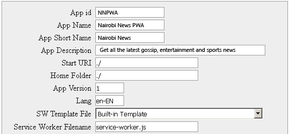

# PWAssist: PWA Generator

This is a small PHP class for easily generating PWA (Progressive Web Applications) files creation : service-worker (javascript), manifest.json,
and generating icon set for all needed resolutions from a single image.

## Using

Simplest way to start using PWAssist, is by following these steps:
- in the root folder of your project create simple "make" php file like this (for example, pwagenerate.php):

```php
// file : pwagenerate.php
include_once('../src/PWAssist.php');
PWAssist::init();
```
- open this file in your browser, (the current folder must be somewhere inside *DocumentRoot* of your local web server software).
You will see HTML page with three buttons for starting three tasks, and a form for editing and saving your PWA parameters (this will make/update pwa_config.xml file
in the current folder).




Note that __SW Template File__ is a select box, because we have registered templates in the 
global config file (described later).

- After performing "Save parameters" you will have "pwa_config.xml" with all desired configuration. Now you can press  any of "action" button (icons, Service worker file, manifest.json)
 or run pwagenerate.php from the shell:
```sh
$ php pwagenerate.php {command} [{command} ...]
```
where {command} is one of icons, manifest, sw, all.
- icons - creates icon files for all your registered sizes. These files will be listed in manifest.json as icons for different resolutions.
- sw - creates service worker javascript file
- manifest (or man) - creates manifest.json file
- all - performs all these tasks in the following order: icons, manifest, sw.
So calling "all" is equivalent to "icons manifest sw".

## Configuration XML file

XML configuration file for your application has a name "pwa_config.xml" and placed in the "current" folder with your pwagenerate.php.

You can edit this file manuallty in text editor or enter all needed values in HTML form and press "Save parameters" button.
Here is a supported parameters list.
- __App id__ (in XML - appId) - Uniquie ID for your application. Must comply "variables naming" rules. Used to form cache name in case you leave it empty.
- __App Name__ (appName) - Application name ( value for __name__  in manifest.json)
- __App Short Name__ (appShortName) - short application name (value for __short_name__ in manifest.json)
- __App Description__ (appDesc) - application description (value for __description__ in manifest.json)
- __Start URI__ (appDesc) - application description (value used as __start_url__ in manifest.json and as a first item in precache file list inside SW script)
- __Home Folder__ : by default work performed on current folder, you started your pwagenerate.php from.
If you need to have another "document root" for your files, change default "./" to a right path (relative to current folder).
- __App Version__ (appVersion) - application current version (will be used in cacheName in service worker,
so after changing version newly generated SW script could force clearing from old cache and populate new one)
- __Lang__ (lang) will be used in manifest "lang" parameter.
- __SW template file__ (swTemplate) : here you can set your service-worker template file , to use instead of "standard" built-in code.
If you set your own name and such file won't be found in the folder with PWAssist.php,
service-worker creating task will fail.

Standard template code for service worker code is inside PWAssist.php module.
It is based on service worker code from Google developer examples (cache-First approach) and slightly modified
to be able insert "parameterized" blocks, like generated filelist to cache, cache name, string for detecting
"dynamic" URL that should be requested directly without caching.

- __Service Worker Filename__ (swFilename) : name for the generated SW script file. Default is "service-worker.js"
- __Cached File Extensions__ (fileTypes) : comma separated extensions of files that will be pre-cached (included in file list in SW script).
- __Folders To Ignore__ (ignoreFolders) : folder names that won't be scanned for files to pre-cache.
- __Cached Files Size Limit__ (fileSizeLimit) : cached files size limit; all files bigger then this won't be cached.
Size can be set with "M" or "K" postfix : "2M" means 2 MegaBytes (equivalent to 2097152 or 2048K), 100K is 100 KiloBytes.
- __Files To Ignore__ (ignoreFiles) : comma separated file mask for files to be excluded from cache file list.
- __Cache Name__ (cacheName) : string will be used with appVersion for dataCacheName and cacheName variables in SW script.
- __Source Icon File__ (baseIcon) : path to the source image that will be used to create icons in all listed resolutions.
If image with this name not found, "icons" task will be rejected.
- __All Icon Sizes__ (iconResolutions) : comma separated resoluitons for application icon. Icons for all listed size will be generated by "icons" task
 and included in mainfest.json file in "manifest" task.
- __Icon Filename Template__ (baseIcon) : string template for icon files, here "{size}" is a placeholder for image resolution (pix).
For example, if you set "img/myapp{size}.png", program wiill create folder "img" (if it does not exist yet), and image files
img/myapp48.png, img/myapp96.png etc.
- __Background Color__ (backgroundColor) and __Theme Color__ (themeColor) are just a values for "background_color" and "theme_color" in generated manifest.json
- __Dynamic Requests Contain__ (dynamicPart) : comma separated list of substrings that will say our service worker "I am dynamic request, don't cache me".
So when your application call GET request that includes one of these strings, SW will make direct network request.

If you open your saved pwa_config.xml in text editor, you may find some non-empty parameters missing.
This occurs when their values are equal to "default" ones.

## Macros in Service Worker template
You have to prepare "mustashed" macros inside your template to be replaced with final values.
- {version} will be replaced with App Version,
- {cachename} - cacheName parameter
- {dynamicTest} will be changed to js code for checking for all "dynamicPart" items, so any matching will activate request to Server.
- {created_date} for date and time of creation SW module,
- {author} will be replaced with Your author's name,
- {copyright} - your copyright string (author and copyright can be set in global configuration file, see below)
- {filelist} - generated precached filelist will be inserted in place of this string.

## Global configuration file.
Default values for all application parameters are hard-coded inside PWAssist.php, in static variable $defaultCfg.
But if you want to change them, you can create another XML file: __PWAssist-global-cfg.xml__.
It must be saved in one folder with PWAssist.php module.

Any parameter included in this file will overwrite "hard-coded" default value.
For example, here you can set your author's name and copyright strings that will apply to all your applications.

Another feature of global config : you can register your service-worker code templates here, so you can choose one of them
for generating final SW module.

Below is an example of PWAssist-global-cfg.xml with a  registering two sw templates block:

```XML
<?xml version="1.0" encoding="UTF-8"?>
<PWA-config>
  <author>My name</author>
  <copyRight>my little big company</copyRight>
  <ignoreFolders>res</ignoreFolders>
  <ignoreFiles>test*.html,_temp*.*,*.log</ignoreFiles>
  <fileSizeLimit>256K</fileSizeLimit>
  <cacheName>myapp_cache</cacheName>
  <dynamicPart>?refresh=</dynamicPart>
  <lang>en-EN</lang>
  <iconResolutions>44,128,152,256</iconResolutions>
  <baseIcon>res/icon.png</baseIcon>
  <iconFilenameTemplate>img/iconapp-{size}.png</iconFilenameTemplate>
  <backgroundColor>#CCCCFF</backgroundColor>
  <themeColor>#AACCFF</themeColor>
  <swTemplates>
    <swTemplate src="PWAssist-cacheFirst.js" title="Cache-First" />
    <swTemplate src="PWAssist-networkFirst.js" title="Network-First" />
  </swTemplates>
</PWA-config>
```

When PWAssist has a non-empty list of SW templates, it will create "select-box" for "SW Template" field instead of standard text input,
in the "Application parameters" form.

Sample global configuration file is in src folder. 

__Note__ : it contains registered SW templates just to show you how to use this feature. 
Respective js files not included, so if you try to select one of them for generating 
service-worker in your application, the task will fail !

## Source Image file for icons.
I hope you understand that source image for all icons must have resolution greater or equal to the most large icon.
Otherwise you will get upscaled pictures looking not so good.

PNG format is preferred for source image, as it supports transparency.
Other source image types supported (gif, webp, jpg), but if you choose some ot them, PWAssist will try to create png icons from it,
probably without transparency areas.

## WEBP source image support.
Alhough PHP has a function for opening WEBP image files (imagecreatefromwebp()), I found it can work with artefacts (color shifting
or even black color on the whole loaded picture). So be ready to get strange results if you use WEBP source file for your icons.

## Demo
Working sample demonstrating "service page" with all buttons for creating PWA modules :
[pwagenerate.php](pwagenerate.php)

## License
Distributed under MIT License :
http://opensource.org/licenses/MIT

2017 - 2018 Peter Koech, [kipkoech.com](https://kipkoech.com/)
If you find it useful, let me know :wink:
You can contact me on [email](mailto:peter.koech@gmail.com).
# PWA-Generator
